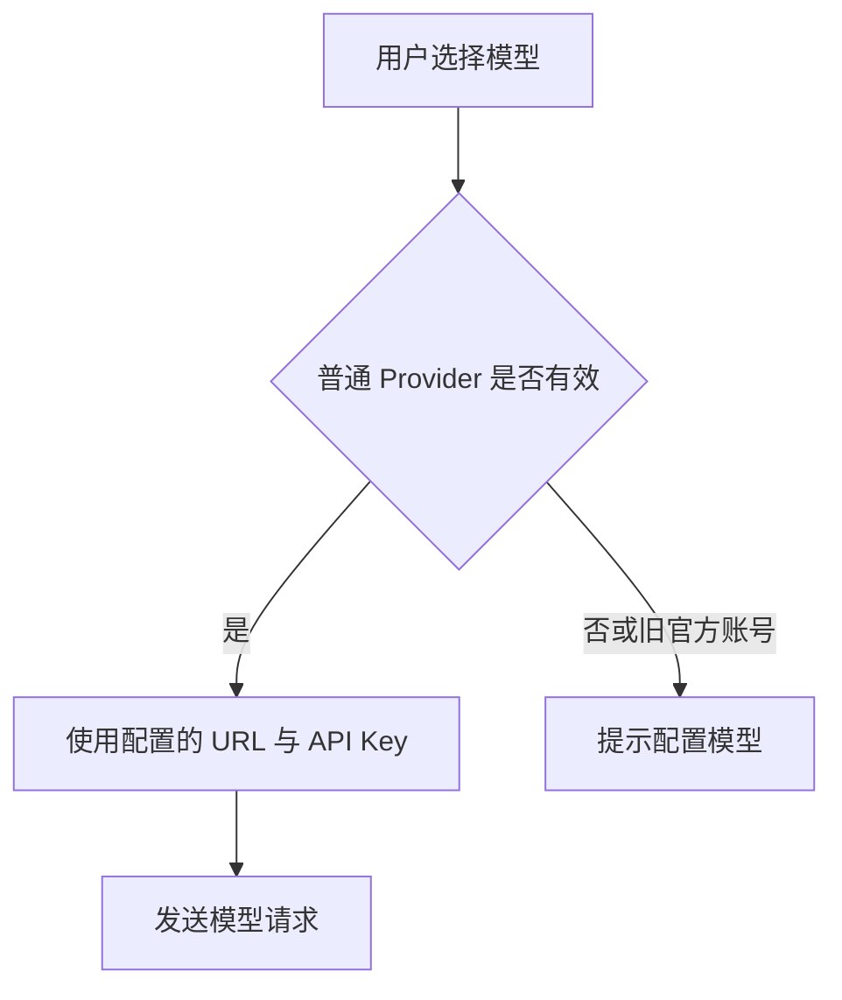

# 模型端点边界

独立 Coding Harness 直接使用用户配置的 Provider URL 与 API Key。普通 GLM API 与其他供应商一致；不按地区、账号、版本或套餐改写为原厂网关，也不自动注入官方凭据。

历史官方账号选择必须显式重新选择普通 Provider，不自动切换计费来源。用户配置的通用 MCP OAuth 与模型 API Key 保持独立。

```mermaid
flowchart TD
  A[用户选择模型] --> B{普通 Provider 是否有效}
  B -->|是| C[使用配置的 URL 与 API Key]
  B -->|否或旧官方账号| D[提示配置模型]
  C --> E[发送模型请求]
```
